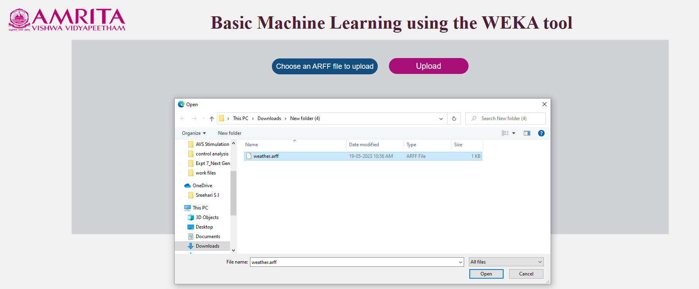
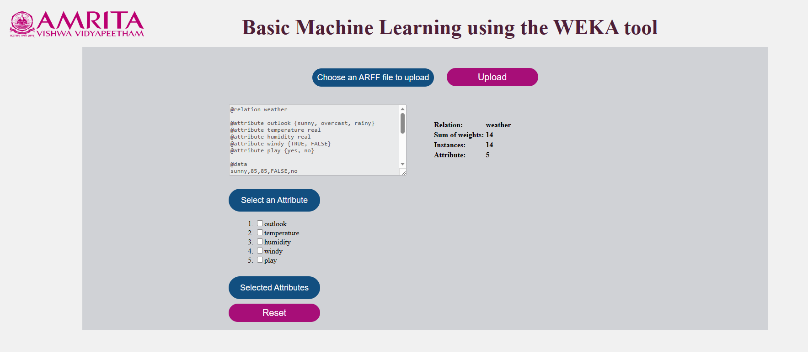
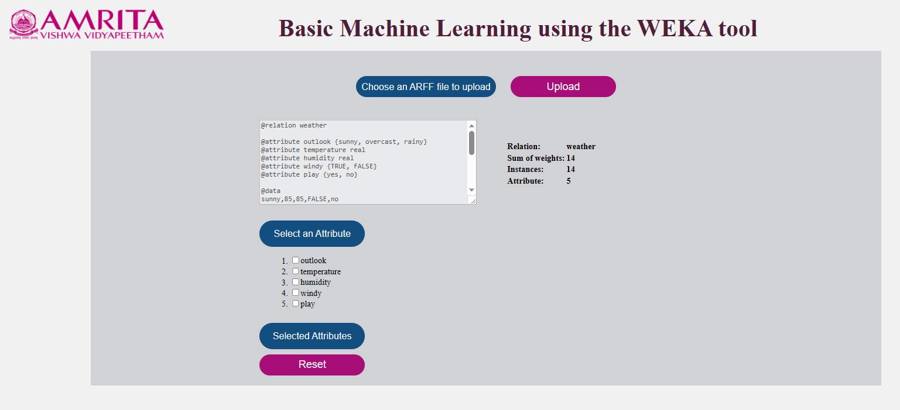
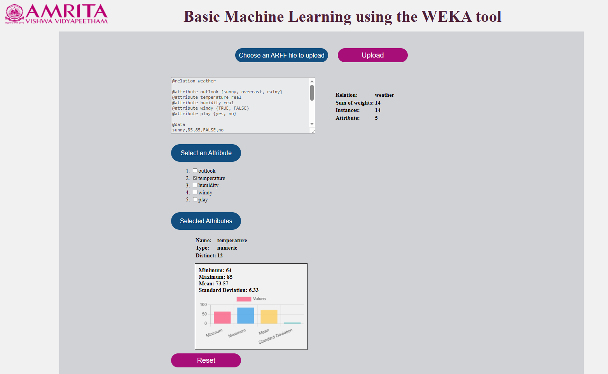
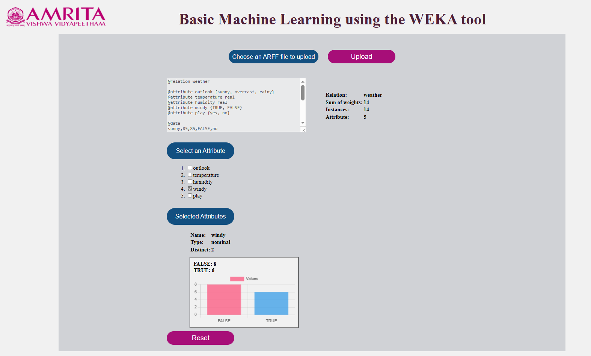
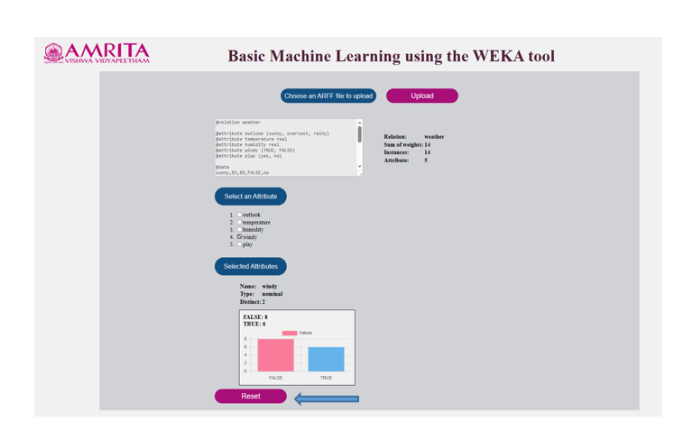

### Procedure

User can learn about the different steps of basic machine learning tool, WEKA using the developed graphical user interface. Data pre-processing is a critical phase of machine learning. Before performing the classification or regression procedures in a machine learning application, the Stimulator explicitly describes the step-by-step process. 

Steps to use the simulator is as follows:

1.	Open the simulator window

•	An ARFF data file (Attribute-Relation File Format) is need to upload in the simulator.

2.	Choose an ARFF data sample file from the computer. For the purpose of giving an example, an ARFFF file with various attributes of weather conditions (outlook, temperature, humidity, windy, play) was chosen.

3.	User have to upload the ARFF data file on the stimulator by clicking on the Upload button.

 

4.	User have to select an attribute of their choice from the given list to get the statistical result (numerical and nominal values of data) of the selected attributes. Here an attribute temperature is selected for giving an example.

5. User can visualize the statistical result ie (standard deviation, mean, minimum and maximum of numerical data and attributes value count of nominal data) of the chosen attribute by clicking on the selected attributes button.

6.	The stimulator also enables the user to select another attribute from the list and visualize the statistical result of the data. For example, another attribute wind is selecting to getting the nominal values (TRUE and FALSE) of the selected attribute. 

7.	After pre-processing the given machine learning data, user can go the home page by clicking on the Reset Button.

