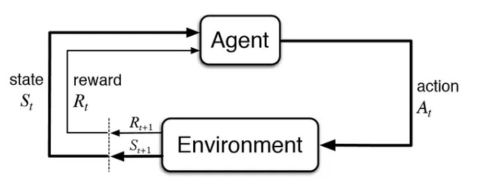
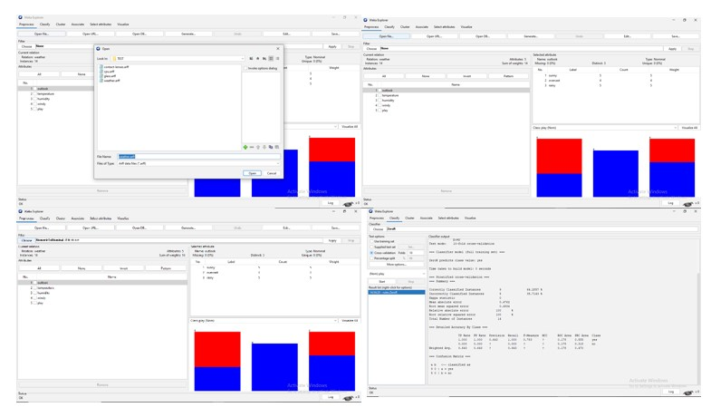
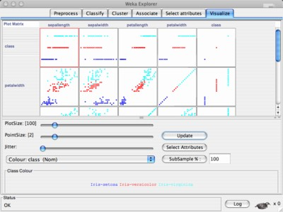

## Introduction

### Artificial Intelligence

Artificial intelligence in modern era have potential to make a revolutionary changes in every aspects of human life. The science of making intelligent computer by robust computing programs were begin in early 1950's from the concept “ Can machines think” by the  renowned scientist Alan Turing, who is known as the founding father of artificial intelligence and modern cognitive science. Artificial intelligence (AI) refers to the simulation of human intelligence in machines that are programmed to think and perform tasks that typically require human-like intelligence. Booming of artificial intelligence in the field of education, healthcare, industries, finance, transportation lead to the development of most innovative and promising technologies and tools that reduces humans physical and cognitive challenges.AI can be achieved through various methods, including machine learning, natural language processing, computer vision, and robotics. Deep learning and Machine learning were the two sub-fields of artificial intelligence combining with computer science and robust datasets.

&nbsp;
#### Application of Artificial Intelligence:

•	Healthcare: AI is being used in medical imaging to detect diseases and injuries such as cancer, heart disease, and brain disorders.

•	Finance: AI is being used in the financial industry to detect fraud and to make predictions about stock prices and other financial trends.

•	Transportation: AI is being used in the development of self-driving cars and other autonomous vehicles.

•	Customer service: AI-powered chatbots and virtual assistants are being used by companies to provide customer service and support.

•	Education: AI is being used to personalize learning experiences for students and to develop intelligent tutoring systems.

•	Manufacturing: AI is being used to improve efficiency in manufacturing processes by optimizing supply chains, predicting maintenance needs, and detecting defects.

•	Agriculture: AI is being used to optimize crop yields, detect pests and diseases, and monitor weather patterns.

&nbsp;
### Deep Learning

Deep learning is a subfield of machine learning which essentially involves an artificial neural networks with three or more layers. The neural networks were designed to stimulate human brain behaviours to learn large amounts of data. Deep learning drives many artificial intelligence (AI) applications and services that improve automation, performing analytical and physical tasks without human intervention. A wide range of applications of including image and speech recognition, natural language processing, and autonomous vehicles.

&nbsp;
### Machine Learning

Machine learning is a subset of AI that involves the use of algorithms and statistical models to enable machines to learn from data and improve their performance over time. It involves training a machine with large amounts of data, allowing it to identify patterns and make predictions or decisions based on that data. Machine learning is used in a variety of applications, including image and speech recognition, recommendation systems, fraud detection, and autonomous vehicles. It has become increasingly popular in recent years due to the explosion of data and the availability of powerful computing resources that enable machines to process and analyse large amounts of data more efficiently. The basic components of machine learning include:

•	Data: Machine learning models require data to learn from. The data can be in the form of structured or unstructured data.

•	Model: A model is a mathematical representation of the data that is used to make predictions or decisions. The model is trained using the data and adjusted until it produces the desired outcome.

•	Algorithm: An algorithm is a set of rules or procedures that a machine learning model uses to learn from the data. There are different types of algorithms such as supervised learning, unsupervised learning, and reinforcement learning.

•	Training: The process of teaching a machine learning model is called training. During training, the model learns to recognize patterns and make predictions based on the data it has been trained on.

•	Testing: After the model is trained, it needs to be tested on new data to see how well it can generalize and make predictions on unseen data.

•	Evaluation: The performance of the model is evaluated using different metrics such as accuracy, precision, recall, and F1 score.

&nbsp;
### Machine learning methods

Machine learning models are broadly divided into four types – supervised learning, unsupervised learning, semi-supervised learning, and reinforcement learning.
&nbsp;
#### 1.	Supervised Learning   

In supervised learning models, machines are trained by examples, ie a set of sample labelled data was provided to the machine learning system in order to train it, and on that basis, it predicts the output. Generally the operator gives the machine learning algorithm a predefined dataset with specified inputs and outputs, and the algorithm needs to figure out how to get those inputs and outputs. The algorithm recognises patterns in data, learns from observations, and generate the predictions (Fig.1). The algorithm predicts and is corrected by the operator and this process is repeated till the algorithm reaches a high level of precision. Precisely supervised learning is based on the supervision, i.e. the operator is aware of the response predicted by the machine learning algorithms and its main goal is to map the input data with the output data. 

Fig1: Supervised Machine Learning Model for data Prediction 

Image source: https://www.javatpoint.com/supervised-machine-learning

&nbsp;
Supervised learning can be grouped further in two categories of algorithms:

•	Classification          

•	Regression

##### Classification Algorithms: 

In supervised learning, classification algorithms are used to predict a categorical variable or class label based on the features or attributes of the input data. Some of the commonly used classification algorithms in supervised learning are:

•	Logistic Regression: This is a linear model that predicts the probability of a binary or multi-class output.

•	Naive Bayes: This is a probabilistic model based on Bayes' theorem that calculates the probability of a class given the features.

•	Decision Trees: This algorithm uses a tree-like model of decisions and their possible consequences to predict the class label.

•	Random Forest: This algorithm is an ensemble of decision trees that makes a prediction by aggregating the predictions of multiple decision trees.

•	Support Vector Machines (SVM): This algorithm finds the best separating hyperplane between classes to make predictions.

•	K-Nearest Neighbor (KNN): This algorithm finds the k-nearest neighbors of a data point and predicts the class label based on the majority class among them.

•	Gradient Boosting: This algorithm combines multiple weak learners (e.g., decision trees) to create a strong classifier.

•	Neural Networks: This algorithm uses a network of nodes (neurons) that process input data to predict the class label.

&nbsp;

##### Regression Algorithms: 

In supervised learning, regression algorithms are used to predict a continuous output variable based on the input features or attributes. Some of the commonly used regression algorithms in supervised learning are:

•	Linear Regression: This is a simple and widely used algorithm that models the relationship between the input features and the output variable using a linear equation.

•	Polynomial Regression: This algorithm extends linear regression to capture non-linear relationships between the input features and output variable by adding polynomial terms.

•	Ridge Regression: This algorithm is a regularized version of linear regression that adds a penalty term to the cost function to prevent overfitting.

•	Lasso Regression: This algorithm is another regularized version of linear regression that uses the L1 regularization technique to encourage sparsity in the model.

•	Elastic Net Regression: This algorithm is a combination of Ridge and Lasso regression that uses both L1 and L2 regularization techniques to balance between bias and variance.

•	Decision Tree Regression: This algorithm uses a tree-like model of decisions and their possible consequences to predict the continuous output variable.

•	Random Forest Regression: This algorithm is an ensemble of decision trees that makes a prediction by aggregating the predictions of multiple decision trees.

•	Gradient Boosting Regression: This algorithm combines multiple weak learners (e.g., decision trees) to create a strong regressor.

•	Support Vector Regression (SVR): This algorithm finds the best fitting hyperplane between the input features and output variable to make predictions.

•	Neural Network Regression: This algorithm uses a network of nodes (neurons) that process input data to predict the continuous output variable.

&nbsp;
#### 2.	Unsupervised Learning

Unsupervised learning is a learning method in which a machine learns without any supervision. The machine learning programme examines the data to detect trends. There is no response key or human interference to provide guidance. Instead, the machine analyses available data to discover correlations and linkages. The machine learning algorithm is left to evaluate massive data sets and address that data in an unsupervised learning process. The programme attempts to organise the data in a way that describes its structure. This could imply organizing the data into clusters or structuring it in a more organised manner. As it evaluates additional data, its capability to make decisions based on that data increases and gets more refined. The main goal of unsupervised learning is to restructure the input data into new features or a group of objects with similar patterns (Fig.2).

&nbsp;

Fig 2: Unsupervised Machine Learning Model for data Prediction
                           
Image source: https://www.javatpoint.com/supervised-machine-learning

&nbsp;

Unsupervised learning can be further classifieds into two categories of algorithms:

•	Clustering

•	Association

&nbsp;

##### Clustering Algorithms: 

Clustering algorithms are a type of unsupervised learning technique that aims to group similar objects or data points together in a way that maximizes intra-cluster similarity and minimizes inter-cluster similarity. There are several types of clustering algorithms, including:

•	K-Means Clustering: This is one of the most popular clustering algorithms. It involves partitioning data points into K clusters, where K is a predefined number. Each cluster is represented by its centroid, which is the mean of all the data points in that cluster. The algorithm iteratively assigns data points to the closest centroid, updates the centroids, and repeats until convergence.

•	Hierarchical Clustering: This is a clustering algorithm that builds a hierarchy of clusters by either recursively merging smaller clusters (agglomerative) or dividing larger clusters (divisive). The result is a dendrogram that represents the hierarchy of clusters.

•	Density-Based Clustering: This algorithm groups data points that are close to each other in terms of density. The clusters are formed around high-density regions and separated by low-density regions.

•	Gaussian Mixture Models: This algorithm assumes that the data points are generated from a mixture of Gaussian distributions. It tries to estimate the parameters of the Gaussian distributions and assigns each data point to the most likely distribution.

•	DBSCAN (Density-Based Spatial Clustering of Applications with Noise): This algorithm groups together data points that are closely packed together and separates them from points that are far away. It can identify noise and outliers in the data.

These clustering algorithms are useful in a variety of applications such as image segmentation, document clustering, customer segmentation, and anomaly detection.

&nbsp;

##### Association algorithms: 

Association algorithms are another type of unsupervised learning technique that aims to discover interesting relationships or patterns between different variables in a dataset. These algorithms are often used for market basket analysis, where the goal is to identify which items are frequently purchased together. Some popular association algorithms include:

•	Apriori Algorithm: This algorithm is based on the idea of frequent itemsets, which are subsets of items that appear together in a transaction with a frequency greater than a predefined threshold. The algorithm generates a list of rules that indicate the likelihood of an item being purchased given the presence or absence of other items in the transaction.

•	FP-Growth Algorithm: This algorithm is a variation of the Apriori algorithm that uses a frequent pattern (FP) tree to compress the data and speed up the computation of frequent itemsets. It generates a set of rules that indicate the association between items in a transaction.

•	ECLAT Algorithm: This algorithm is similar to the Apriori algorithm but uses vertical data format to compress the data and speed up computation. It finds frequent itemsets by intersecting transaction lists.

&nbsp;

#### 3.	Reinforcement Learning

Reinforcement learning focuses on training agents to make optimal decisions in an environment. The goal of reinforcement learning is to develop algorithms that can learn from experience and improve their performance over time. In reinforcement learning, an agent interacts with an environment by taking actions and receiving feedback in the form of rewards or penalties. The agent's goal is to learn a policy that maximizes its long-term reward. The agent learns by exploring different actions and observing their outcomes, updating its policy based on the rewards it receives. Reinforcement learning has a wide range of applications, including robotics, game playing, finance, and healthcare. Some popular reinforcement learning algorithms include Q-learning, SARSA, and deep reinforcement learning. Overall, reinforcement learning is a powerful approach to machine learning that allows agents to learn from experience and improve their decision-making over time

&nbsp;

Fig.3: Reinforcement Machine learning Model

Image source: https://towardsdatascience.com/reinforcement-learning-101-e24b50e1d292

## Machine Learning using WEKA Tool

WEKA (Waikato Environment for Knowledge Analysis) is a popular open-source machine learning tool that provides a graphical user interface to perform various machine learning tasks. It is a collection of machine learning algorithms for data mining tasks and contain tools for data preparation, classification, regression, clustering, association rules mining, and visualization. The basic steps to use WEKA for machine learning as follows:

1.	Install and launch WEKA tool: User can download WEKA from the official website (https://www.cs.waikato.ac.nz/ml/weka/ ). Once downloaded, extract the files and launch WEKA from the command prompt or by double-clicking the WEKA.jar file.

&nbsp;

2.	Load the dataset: WEKA supports a wide range of data formats. You can import the dataset by selecting the "Explorer" option from the WEKA menu and then choosing the "Open file" option. You can also use the command-line interface to load the dataset.

&nbsp;

3.	Pre-process the data: Pre-processing is an essential step in machine learning. It involves cleaning the data, handling missing values, normalizing the data, and more. WEKA provides a range of pre-processing techniques, which you can access by selecting the "Pre-process" option from the "Explorer" menu. The steps involved in pre-processing methods in WEKA are:

•	Data cleaning: This involves removing irrelevant, incomplete, or inconsistent data. WEKA provides various filters for data cleaning, such as RemoveWithValues, Remove Duplicates, and ReplaceMissingValues.

•	Data transformation: This involves transforming the data to improve its quality or to meet the requirements of a specific algorithm. WEKA provides various filters for data transformation, such as Normalize, Discretize, and Attribute Selection.

•	Feature selection: This involves selecting a subset of relevant features from the original dataset. WEKA provides various feature selection methods, such as Principal Component Analysis (PCA), Correlation-based Feature Selection (CFS), and Genetic Search.

•	Data integration: This involves combining data from multiple sources. WEKA provides various filters for data integration, such as MergeNominalValues, MergeTwoValues, and Merge Infrequent Nominal Values.

•	Data reduction: This involves reducing the size of the dataset while maintaining its quality. WEKA provides various filters for data reduction, such as Random Subset, Remove Percentage, and Instance Subset.

•	Attribute generation: This involves creating new attributes based on the existing ones. WEKA provides various filters for attribute generation, such as Add Expression, Add Values, and Add Cluster.

&nbsp;
   

&nbsp;

4.	Select a machine learning algorithm: Once the data is pre-processed, user can select a machine learning algorithm from the "Classify" or "Cluster" tab. WEKA provides a variety of machine learning algorithms, including decision trees, naive Bayes, support vector machines, k-nearest neighbors etc.

&nbsp;

5.	Train and test the model: After selecting the machine learning algorithm, you can train the model by selecting the "Start" button from the "Classifier" tab. Once the model is trained, you can test its accuracy by selecting the "Supplied test set" option from the "Test options" dropdown menu.

&nbsp;

6.	Evaluate the model: After testing the model, you can evaluate its performance by selecting the "Classifier output" option from the "More options" dropdown menu. You can also visualize the results using the "Visualize" button.

&nbsp;

### Panels in WEKA Tool

•	Classify panel: This panel is used to build classification models using various algorithms. It includes options for selecting the classifier, setting its parameters, and evaluating the model's performance.

•	Cluster panel: This panel is used to perform clustering analysis on the dataset. It includes options for selecting the clustering algorithm, setting its parameters, and evaluating the clustering results.

&nbsp;
   

&nbsp;

•	Associate panel: This panel is used to discover association rules between different attributes in the dataset. It includes options for selecting the association algorithm, setting its parameters, and visualizing the discovered rules.

•	Select attributes panel: This panel is used to select relevant attributes for building a model. It includes options for selecting the attribute evaluator, setting its parameters, and performing feature selection.

&nbsp;
   

&nbsp;

•	Visualize panel: This panel is used to visualize the dataset and the results of the analysis. It includes options for plotting histograms, scatterplots, and decision boundaries of the models.

&nbsp;
   

&nbsp;

These panels provide a user-friendly interface to perform various tasks in the machine learning workflow, from pre-processing to model evaluation.

Familiarization of panels in WEKA tool- Image source-https://www.cs.waikato.ac.nz/~ml/weka/gui_explorer.html
